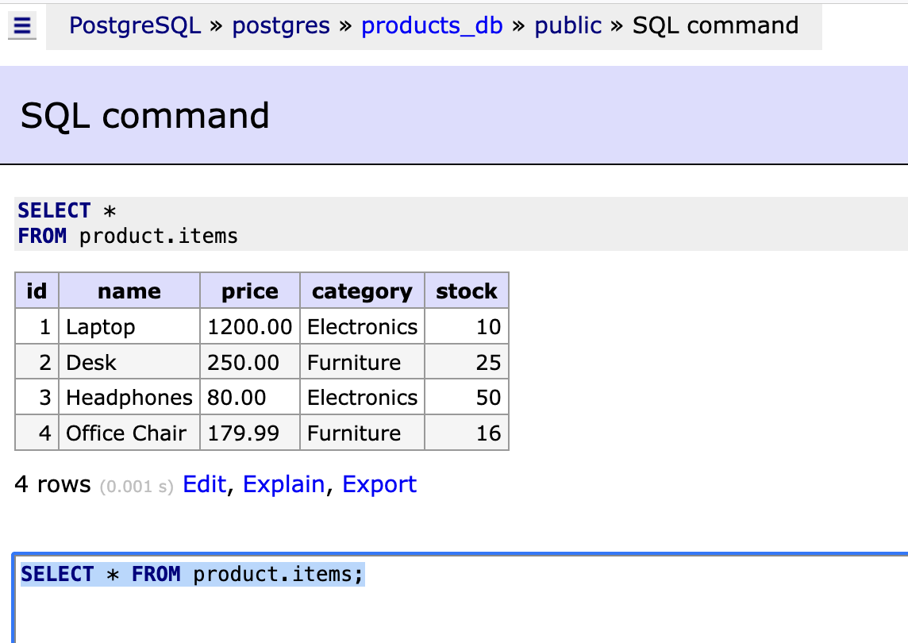

# Run the Python script
python load_products.py

# Access the PostgreSQL container
docker exec -it pg psql -U postgres -d products_db

# Query all items from the product table
SELECT * FROM product.items;

# Adminer Screenshot

